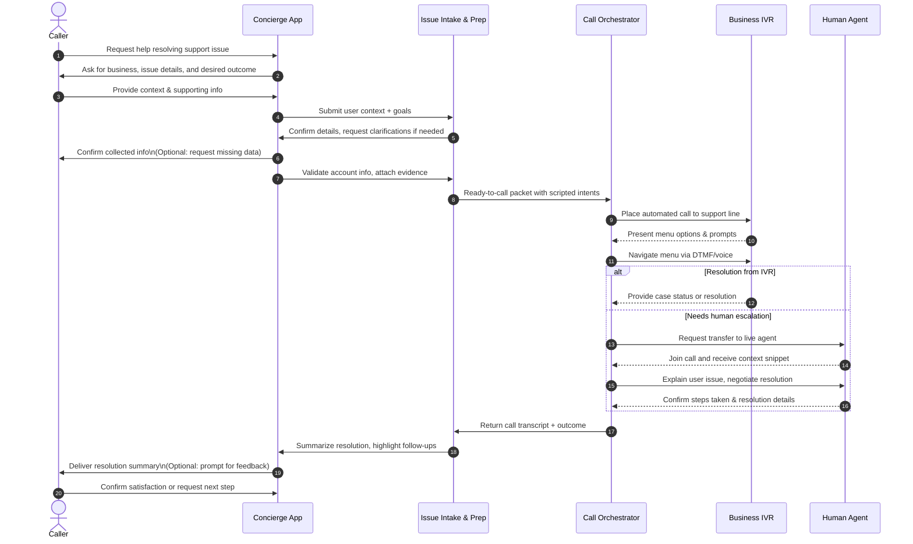

# User Journey Workflow

```mermaid
sequenceDiagram
    autonumber
    actor Caller
    participant App as Concierge App
    participant Intake as Issue Intake & Prep
    participant CallMgr as Call Orchestrator
    participant IVR as Business IVR
    participant Agent as Human Agent

    Caller->>App: Request help resolving support issue
    App->>Caller: Ask for business, issue details, and desired outcome
    Caller->>App: Provide context & supporting info
    App->>Intake: Submit user context + goals
    Intake->>App: Confirm details, request clarifications if needed
    App->>Caller: Confirm collected info\n(Optional: request missing data)
    App->>Intake: Validate account info, attach evidence
    Intake->>CallMgr: Ready-to-call packet with scripted intents

    CallMgr->>IVR: Place automated call to support line
    IVR-->>CallMgr: Present menu options & prompts
    CallMgr->>IVR: Navigate menu via DTMF/voice
    alt Resolution from IVR
        IVR-->>CallMgr: Provide case status or resolution
    else Needs human escalation
        CallMgr->>Agent: Request transfer to live agent
        Agent-->>CallMgr: Join call and receive context snippet
        CallMgr->>Agent: Explain user issue, negotiate resolution
        Agent-->>CallMgr: Confirm steps taken & resolution details
    end

    CallMgr->>Intake: Return call transcript + outcome
    Intake->>App: Summarize resolution, highlight follow-ups
    App->>Caller: Deliver resolution summary\n(Optional: prompt for feedback)
    Caller->>App: Confirm satisfaction or request next step
```
